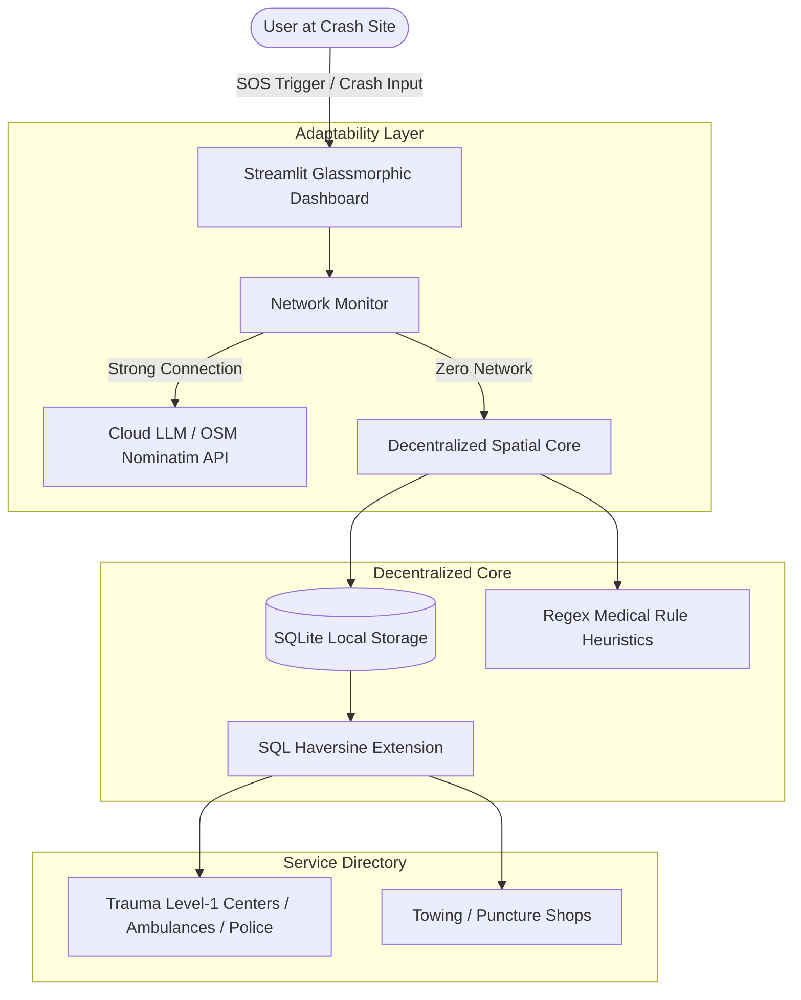

# 🛡️ GuardianSOS: The Intelligent Golden-Hour Responder

> **National Road Safety Hackathon | Submission Title**  
> *"Bridging the Golden Hour with Offline-First AI and Decentralized Emergency Intelligence."*

---

## ⚡ The Golden-Hour Vision
Every year, over **1.3 million lives** are lost in road traffic accidents globally. Clinicians agree that the first **60 minutes** post-trauma—known as the **Golden Hour**—is the absolute critical window where rapid medical intervention cuts mortality rates in half. 

**GuardianSOS** is a zero-friction, offline-first emergency coordination system that adapts dynamically to network health. Under high-speed internet, it engages sophisticated cloud triage algorithms; under cellular dead zones, it activates a local SQLite spatial matching engine and a deterministic triage classifier to guide bystanders and dispatchers within milliseconds, without making a single network request.

---

## 🚀 Key Features (Why GuardianSOS Wins)

1. **Tri-State Network Adaptor**: 
   - **ONLINE**: Integrates full cloud AI models and live OpenStreetMap map tiles.
   - **LOW NETWORK**: Compresses JSON payloads and utilizes fast, lightweight responses.
   - **OFFLINE**: Fully decouples from the cloud, leveraging an offline SQLite database and mathematical rules.

2. **Sub-Second Offline Spatial Core**:
   Registers a custom **Haversine Distance mathematical function** in pure SQLite to calculate real-world spherical distances and bearings (`N`, `SW`, `NE`) from local databases in **under 5 microseconds**. No native dependencies required!

3. **Hybrid AI Urgency Triage**:
   Analyzes collision details (speed, airbag deployment, passenger count, vital symptoms) to instantly output clinical severity categories (**RED** Urgent, **YELLOW** Intermediate, **GREEN** Stable) and dispatch instructions.

4. **Offline First-Aid Clinical Coach**:
   Automatically recommends step-by-step first aid guides (severe bleeding, unresponsive CPR, neck/spinal injury, limb fractures) matching the crash incident context.

5. **Judge-Ready Network Simulator**:
   Includes an interactive, visual sidebar control that lets judges manually kill the network connection to watch the entire platform search, route, and triage 100% locally.

---

## 📂 Repository Folder Structure

```text
RoadSoS/
│
├── .streamlit/
│   └── config.toml               # Streamlit UI Theme configuration (Dark Theme)
│
├── assets/
│   └── styles.css                # Injectable custom premium glassmorphism styles
│
├── data/
│   ├── seed_data.py              # Script to seed global facility details
│   └── guardiansos.db            # Local SQLite database holding loaded points of interest
│
├── src/
│   ├── __init__.py
│   ├── database.py               # SQLite custom Haversine registration and schemas
│   ├── network_detector.py       # Tri-state connectivity adapters
│   ├── geolocation.py            # Bearings, directional arrow compasses & Nominatim API
│   ├── first_aid_data.py         # Step-by-step clinical offline manuals
│   └── ai_engine.py              # Hybrid AI classifier & mock cloud engine
│
├── app.py                        # Core Streamlit command dashboard
├── requirements.txt              # Package dependencies
├── Presentation.md               # 7-Slide Pitch & Speaker speaking guide
└── README.md                     # Project submission file
```

---

## 🏗️ Technical Architecture



---

## 🎯 The Perfect Live Demo Flow
Here is the step-by-step golden demo flow designed to secure **maximum points** in under 3 minutes:

1. **The Hook (Land & Orient)**: Show the beautiful, glassmorphic dark dashboard. Explain that you are located in Indiranagar, Bengaluru. Point out the active user Medical Card (Karan Malhotra, Blood Group A+).
2. **The Offline Threat (Toggle Offline)**: Explain that national highways have severe network dead zones. **Select `OFFLINE`** on the network simulator. Watch the status ribbon turn high-visibility warning orange.
3. **The Incident (Triage & AI)**: Input a crash report: *"Rollover incident on highway. Passenger is breathing but unresponsive."* set speed to **80 km/h** and airbag to **Yes**. Click **Analyze**.
4. **The Wow-Factor (Instant Local Match)**: 
   - **Triage Result**: Instantly renders a **RED Urgency Badge** with critical spinal trauma risks and dispatch instructions without network calls.
   - **Nearest Directory**: Shows exact distances (e.g. *St. John's Medical College Hospital - 1.25 km*) with directional bearing compass arrows (*↗ NE*).
   - **Clinical First Aid**: Tab 3 displays immediate, high-contrast, step-by-step cervical spine stabilization guidelines.
5. **The Proof (Online Sync)**: Toggle the simulator back to **ONLINE**. The status ribbon turns emerald, and an interactive spatial dark-theme map loads, showing exact geocoded incident coordinates.

---

## 🏃 Getting Started & Running Locally

### 1. Pre-requisites
Ensure you have Python 3.9+ installed on your system.

### 2. Install Dependencies
```bash
pip install -r requirements.txt
```

### 3. Initialize & Seed Local SQLite Database
Run the seeding script to populate global facilities across major metropolitan hubs (Delhi, Mumbai, Bengaluru, New York, London):
```bash
python data/seed_data.py
```

### 4. Run the Streamlit Application
```bash
streamlit run app.py
```
Open [http://localhost:8501](http://localhost:8501) in your browser.

---

## 🏆 Presentation Slides (7-Slide Structure)
*The full presentation deck blueprint and judge Q&A defense document are available in the repository file [Presentation.md](file:///c:/Users/heman/OneDrive/Desktop/RoadSoS/Presentation.md).*
